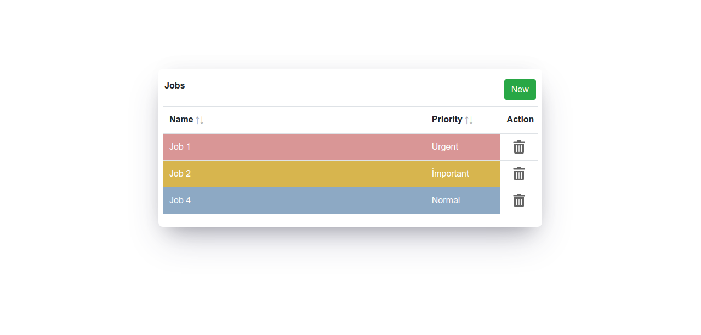

# Personal Job Tracking Demo App
### [Live Site](https://personal-job-tracking-app.netlify.app/)

## Introduction
Personal Job Tracking App is a demo app to manage job records.

### Features

- Ability to add, order, delete, change a job record that has priority.
- Editable, colorful rows.
- Responsive Design.
- Ability to keep data on web storage.

## Usage
run `npm start`, browse `localhost:3000`

## Reference
- [Bootstrap](https://getbootstrap.com/docs/4.0/getting-started/introduction/)
- [React Icons](https://react-icons.github.io/react-icons/icons?name=fa)
- [React Select](https://react-select.com/home)
- [Bootstrap Table Next](https://react-bootstrap-table.github.io/react-bootstrap-table2/docs/about.html)